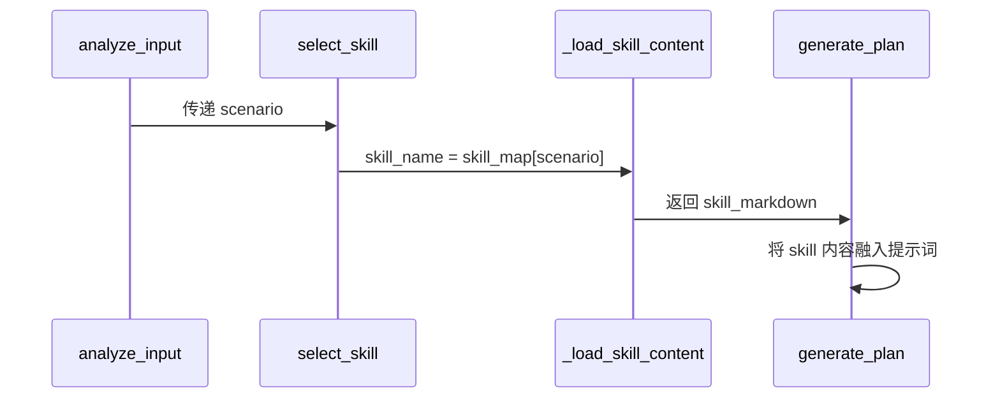

# Agent 工作流程可视化文档

## 目录
- [概述](#概述)
- [核心设计原则](#核心设计原则)
- [完整工作流程图](#完整工作流程图)
- [节点详解](#节点详解)
  - [analyze_input：意图分析](#analyze_input意图分析)
  - [select_skill：技能选择](#select_skill技能选择)
  - [generate_plan：方案生成](#generate_plan方案生成)
  - [wait_confirmation：等待确认](#wait_confirmation等待确认)
  - [execute_plan：执行下单](#execute_plan执行下单)
  - [format_result：格式化输出](#format_result格式化输出)
  - [handle_interrupt：处理打断](#handle_interrupt处理打断)
  - [handle_preference：处理偏好](#handle_preference处理偏好)
- [Skill 加载机制](#skill-加载机制)
- [提示词设计](#提示词设计)

---

## 概述

本 Agent 采用 **"永远给答案，不反问"** 的设计理念，基于 LangGraph 状态图驱动。用户输入后直接生成方案，使用智能默认值填充缺失信息，而非追问用户。

**核心变更**:
- ❌ 移除 `gather_info` 反问节点
- ✅ 新增 `defaults_applied` 智能默认值系统
- ✅ 新增 `time_period` 时间段标签（morning/afternoon/evening/full_day）

---

## 核心设计原则

```
┌─────────────────────────────────────────────────────────────┐
│                   【永远给答案，不反问】                     │
├─────────────────────────────────────────────────────────────┤
│  1. 人数未说明 → 默认4人（朋友）或2人（其他）                │
│  2. 预算未说明 → 默认100-150元/人（中档）                   │
│  3. 位置未说明 → 使用 home_location 或假设市区内             │
│  4. 时间未说明 → 根据关键词推断（晚饭→evening）              │
└─────────────────────────────────────────────────────────────┘
```

---

## 完整工作流程图

```mermaid
graph TD
    START[用户输入<br/>自然语言] --> ANALYSIS[analyze_input<br/>意图分析]
    
    ANALYSIS -->|intent=preference| PREF[handle_preference<br/>处理偏好]
    ANALYSIS -->|intent=confirm| EXEC[execute_plan<br/>执行下单]
    ANALYSIS -->|intent=interrupt| INTERRUPT[handle_interrupt<br/>处理打断]
    ANALYSIS -->|intent=plan| SELECT[select_skill<br/>技能选择]
    
    SELECT --> GENERATE[generate_plan<br/>方案生成]
    GENERATE --> WAIT[wait_confirmation<br/>等待确认]
    
    INTERRUPT --> GENERATE
    
    EXEC --> FORMAT[format_result<br/>格式化输出]
    
    PREF --> END[结束]
    WAIT --> END
    FORMAT --> END
    
    WAIT -->|用户确认| EXEC
    WAIT -->|用户修改| INTERRUPT
    
    classDef node fill:#e1f5ff,stroke:#333,stroke-width:2px;
    classDef end fill:#fff,stroke:#333,stroke-width:2px,stroke-dasharray:5,5;
    
    class ANALYSIS,PREF,EXEC,INTERRUPT,SELECT,GENERATE,WAIT,FORMAT node;
    class END end;
```

---

## 节点详解

### analyze_input：意图分析

**位置**: [agent/core.py#L96-L148](file:///d:/Workspace/mthackathon/agent/agent/core.py#L96-L148)

**目标**: 分析用户输入，提取结构化信息，不再追问。

**输入**:
- 用户自然语言
- 对话历史（最近6条）
- 用户偏好

**输出** (JSON 格式):
```json
{
  "intent": "plan | preference | query | confirm | modify | interrupt",
  "scenario": "family | friends | couple | solo",
  "extracted_info": {
    "group_size": null,
    "child_age": null,
    "duration_hours": null,
    "budget_range": null,
    "time_preference": null,
    "location_preference": null,
    "special_requirements": []
  },
  "defaults_applied": {
    "group_size": "智能默认：4人（朋友场景）",
    "budget": "智能默认：100-150元/人（中档消费）",
    "location": "智能默认：使用用户偏好中的 home_location 或假设市区内"
  }
}
```

**场景判断规则**:
| 关键词 | 场景 |
|--------|------|
| 孩子/老婆/家人/亲子 | family |
| 朋友/哥们/闺蜜/多人 | friends |
| 对象/女朋友/男朋友/约会 | couple |
| 无明确同伴信息 | solo |
| 晚饭/午餐/早餐/宵夜 | 自动对应时间段 |

---

### select_skill：技能选择

**位置**: [agent/core.py#L151-L179](file:///d:/Workspace/mthackathon/agent/agent/core.py#L151-L179)

**目标**: 根据场景自动匹配对应的 Skill 定义。

**映射关系**:
| 场景 | Skill 目录 | Skill 文件名 |
|------|-----------|-------------|
| family | Parent-ChildTravelPlanning | Parent-ChildTravelPlanning.md |
| friends | FriendsOuting | FriendsOuting.md |
| couple | PersonalTravelPlanning | PersonalTravelPlanning.md |
| solo | PersonalTravelPlanning | PersonalTravelPlanning.md |

**Skill 加载流程**:
```
1. 根据 scenario 选择 Skill 目录
2. 加载 skills/{skill_name}/{skill_name}.md 文件
3. 将 Markdown 内容传入 generate_plan 提示词
```

---

### generate_plan：方案生成

**位置**: [agent/core.py#L186-L289](file:///d:/Workspace/mthackathon/agent/agent/core.py#L186-L289)

**目标**: 直接生成完整的活动方案，不等待追问。

**数据查询**:
```python
# 景点查询（按评分排序，取前5）
attractions = query_attractions(scenario=tag, max_distance=max_dist, child_age=child_age)[:5]

# 餐厅查询（按评分排序，取前5）
restaurants = query_restaurants(
    scenario=tag,
    max_distance=max_dist,
    need_kids_friendly=(scenario == "family")
)[:5]

# 活动查询（按评分排序，取前5）
activities = query_activities(scenario=tag, max_distance=max_dist, child_age=child_age)[:5]
```

**输出** (JSON 格式):
```json
{
  "title": "方案标题",
  "time_period": "evening | afternoon | morning | full_day",
  "timeline": [
    {
      "time": "18:00",
      "end_time": "19:30",
      "type": "meal | activity | transport",
      "name": "活动/餐厅名称",
      "id": "对应ID",
      "address": "地址",
      "cost": 预计费用,
      "cost_per_person": 人均费用,
      "description": "简要描述",
      "reasons": "推荐理由"
    }
  ],
  "total_cost": 总费用,
  "cost_per_person": 人均费用,
  "extra_suggestions": [
    {
      "type": "cake | flower",
      "name": "建议的蛋糕/鲜花",
      "reason": "推荐理由"
    }
  ],
  "tips": ["出行贴士"]
}
```

---

### wait_confirmation：等待确认

**位置**: [agent/core.py#L176](file:///d:/Workspace/mthackathon/agent/agent/core.py#L176)

**目标**: 等待用户审核方案。

**状态逻辑**:
- 用户说「确认」「好的」「执行」等 → 触发 `execute_plan`
- 用户说其他内容 → 视为打断，触发 `handle_interrupt`

---

### execute_plan：执行下单

**位置**: [agent/core.py#L292-L356](file:///d:/Workspace/mthackathon/agent/agent/core.py#L292-L356)

**目标**: 用户确认后自动完成所有预订。

**执行顺序**:
```
1. 遍历 timeline 中的每个 item
   ├─ activity → book_activity()
   │  └─ 类型=电影 → 额外调用 book_movie()
   └─ meal → book_restaurant()
      └─ 亲子场景 → 自动加儿童椅

2. 处理 extra_suggestions
   ├─ cake → order_cake()
   └─ flower → order_flower()

3. 所有订单持久化到 data/orders.json
```

---

### format_result：格式化输出

**位置**: [agent/core.py#L359-L404](file:///d:/Workspace/mthackathon/agent/agent/core.py#L359-L404)

**目标**: 将方案和执行结果格式化为用户友好的文本。

**输出示例**:
```
============================================================
👥 朋友聚会晚餐方案
🌙 晚间
============================================================

📌 基于您的偏好和智能默认设置生成
   人数：智能默认：4人（朋友场景） | 预算：智能默认：100-150元/人

🕐 18:00-19:30 | 🍽️ 外婆家
   📍 南山区海岸城
   📝 杭帮菜代表，菜品精致，性价比高
   💡 排队时间约45分钟，建议提前预约
   💰 人均：65元

...

============================================================
💰 总费用：¥260 | 人均：¥65
============================================================
✅ 已完成操作：
   - [餐厅预约] 外婆家 → 订单号：ORD-20260527-001
```

---

### handle_interrupt：处理打断

**位置**: [agent/core.py#L407-L454](file:///d:/Workspace/mthackathon/agent/agent/core.py#L407-L454)

**目标**: 用户在方案讨论中加入新信息时重新调整方案。

**触发示例**:
```
用户: 今天下午带孩子出去玩
Agent: [生成方案]
用户: 对了，我老婆在减肥
Agent: [分析打断 → 重新生成方案]
```

---

### handle_preference：处理偏好

**位置**: [agent/core.py#L457-L500](file:///d:/Workspace/mthackathon/agent/agent/core.py#L457-L500)

**目标**: 提取和持久化用户偏好。

**支持的偏好类型**:
| 类型 | 说明 |
|------|------|
| preferred_cuisines | 喜欢的菜系 |
| disliked_cuisines | 不喜欢的菜系 |
| dietary_restrictions | 饮食限制 |
| activity_types | 活动类型 |
| max_distance_km | 最远距离 |
| budget_range | 预算范围 |
| companions | 常用同行人 |
| home_location | 家的位置 |
| notes | 自由备注 |

---

## Skill 加载机制

### 目录结构
```
skills/
├── FriendsOuting/
│   └── FriendsOuting.md
├── Parent-ChildTravelPlanning/
│   └── Parent-ChildTravelPlanning.md
└── PersonalTravelPlanning/
    └── PersonalTravelPlanning.md
```

### 加载流程


**实现代码**: [agent/core.py#L30-L43](file:///d:/Workspace/mthackathon/agent/agent/core.py#L30-L43)

---

## 提示词设计

### 提示词存储位置
所有提示词集中管理在: [config/prompts.json](file:///d:/Workspace/mthackathon/agent/config/prompts.json)

### analyze_input 提示词
```
你是一个美团本地活动规划助手的分析模块。
根据用户输入，分析以下信息并返回 JSON：

当前用户偏好：
{prefs_summary}

对话历史：
{context}

请分析用户的最新输入，返回以下 JSON 格式：
{
  "intent": "plan | preference | query | confirm | modify | interrupt",
  "scenario": "family | friends | couple | solo",
  "extracted_info": {...},
  "defaults_applied": {...}
}

【核心原则：永远给答案，不反问】
如果用户没有明确说明人数，假设4人（朋友场景）或2人（其他场景）。
如果用户没有明确说明预算，使用100-150元/人的中档标准。
如果用户没有明确说明位置，使用用户偏好中的 home_location 或假设在市中心5公里范围内。
```

### generate_plan 提示词
```
你是美团本地活动规划助手。【永远给答案，不反问】

根据以下信息，直接生成完整的活动方案。如果某些信息用户没有明确说明，使用智能默认值：
- 人数未说明 → 默认4人（朋友）或2人（其他）
- 预算未说明 → 默认100-150元/人
- 位置未说明 → 使用用户偏好的 home_location 或假设在市中心

场景：{scenario}
出行人数：{group_size}人
用户偏好：
{prefs_summary}

默认填充说明：
{defaults_applied}

可用景点（按评分排序）：
{attractions_json}

可用餐厅（按评分排序）：
{restaurants_json}

可用活动（按评分排序）：
{activities_json}

方案要求：
1. 时间安排合理，考虑交通时间
2. 活动和用餐穿插，不要太紧凑
3. 距离不要太远，尽量在同一区域
4. 餐厅排队时间不要太长
5. 直接生成方案，不要询问用户任何问题
```

---

## 状态定义

**位置**: [agent/state.py](file:///d:/Workspace/mthackathon/agent/agent/state.py)

```python
class AgentState(TypedDict):
    # 对话相关
    messages: Annotated[list[BaseMessage], add_messages]
    user_input: str
    
    # 用户数据
    user_preferences: dict
    
    # 场景与 Skill
    scenario: str
    skill_used: str
    
    # 分析结果
    analysis: dict
    defaults_applied: dict  # 新增：应用的智能默认值
    
    # 方案与执行
    plan: dict
    execution_results: list[dict]
    
    # 流程控制
    step: str
    step_count: int
    needs_confirmation: bool
    interrupted: bool
    new_info: str
```

---

## 新旧设计对比

| 特性 | 旧设计 | 新设计 |
|------|--------|--------|
| 核心原则 | 追问补全信息 | 永远给答案，智能默认值 |
| gather_info 节点 | ✅ 存在 | ❌ 移除 |
| missing_info | ✅ 有 | ❌ 无 |
| defaults_applied | ❌ 无 | ✅ 有 |
| time_period | ❌ 无 | ✅ 有 |
| 用户体验 | 需要多次交互 | 一次输入直接得方案 |

---

## 示例流程

### 场景1：直接规划晚餐
```
用户: 给我规划一下晚饭
  ↓
analyze_input → 提取 intent=plan, scenario=friends
  ↓
select_skill → 加载 FriendsOuting.md
  ↓
generate_plan → 使用默认值（4人，100-150元/人）
  ↓
返回格式化方案 👍
```

### 场景2：带偏好规划
```
用户: /偏好 我不喜欢吃辣
  ↓
handle_preference → 持久化到 data/preferences.json
  ↓
用户: 给我规划一下晚饭
  ↓
analyze_input → 读取偏好，extracted_info 包含不喜欢辣
  ↓
generate_plan → 查询时过滤辣的选项
  ↓
返回不辣的餐厅方案 👍
```

---

**最后更新**: 2026-05-27
